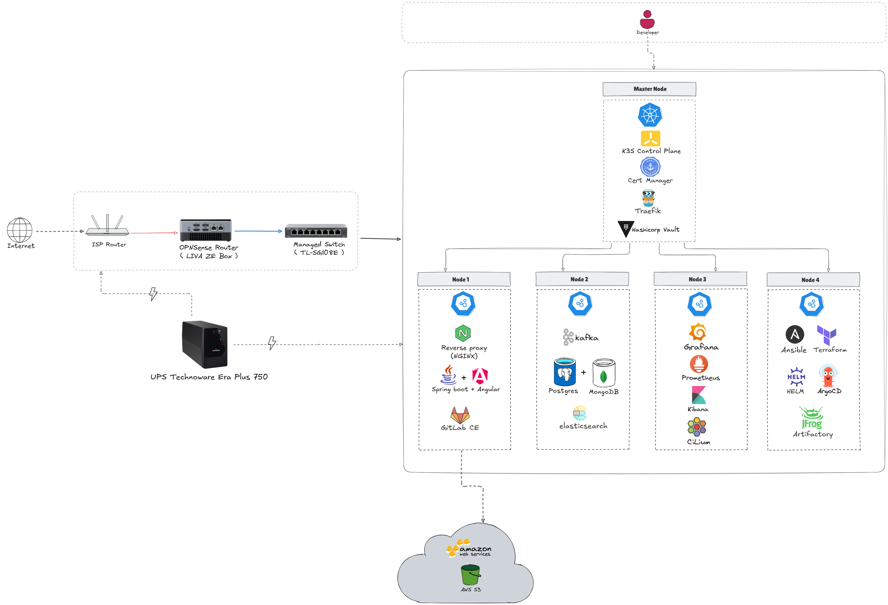

# KubeLab: A Kubernetes cluster homelab

## Overview
**KubeLab** is a hands-on home lab built to master **Linux system administration**, **Kubernetes orchestration**, **networking**, and **DevOps practices**.

It's a place to try out new tools, experiment with GitOps, automate deployments and configs, and test things like backup strategies, security, and scaling. The idea overall is to build something close to a real production environment but with the flexibility to learn, break things and continuously improve.

## Index
- [Documentation for the lab](docs/) 
  - [Networking setup](docs/networking.md)
  - [Lab setup](docs/setup-guide.md)
- [Infrastructure configuration and automation](infrastructure/)
  - [Ansible playbooks for automating the lab setup](infrastructure/ansible/)
  - [Networking walkthroughs, configs, and backups](infrastructure/networking/)

## Hardware
The lab's built from a mix of refurbished HP mini PCs (pretty cheap but they perform surprisingly well), upgraded with DDR4 RAMs and NVMe SSDs for smoother performance, plus a custom router and a managed switch to tie it all together:
- **Node 1**: HP EliteDesk 800 G2 Mini i5-6500T / 16GB DDR4 / 512GB M.2 NVMe + 500GB HDD
- **Node 2**: HP ProDesk 600 G2 Mini i5-6500T / 16GB DDR4 / 512GB M.2 NVMe
- **Node 3**: HP ProDesk 400 G2 Mini i5-6500T / 16GB DDR4 / 512GB M.2 NVMe
- **Node 4**: HP ProDesk 400 G2 Mini i5-6500T / 32GB DDR4 / 256GB M.2 NVMe
- **Node 5**: HP ProDesk 400 G2 Mini i3-6100T / 16B DDR4 / 512GB M.2 NVMe
- **Router**: ECS LIVA ZE (Intel Celeron N3350 / 8GB DDR3L / 256GB SSD) running OPNsense
- **Switch**: TL-SG108E (8-port Gigabit semi-managed switch)
- **UPS**: Tecnoware ERA Plus 750 (750VA/525W) protects nodes/switch/router from blackouts which gives 10-15 minutes of backup

## Technology Stack

The following table outlines the technology stack for **KubeLab**:

|      | Name | Description |
|------|------|-------------|
|  | k3s | Lightweight Kubernetes for running workloads on resource-constrained nodes.|
|  | GitLab CE | Self-hosted CI/CD platform for building, testing, and deploying Java/Angular apps. |
|  | Java | Backend runtime for application logic, integrated with CI/CD pipeline. |
|  | Angular | My frontend framework choice. |
|  | Kafka | Distributed streaming platform for event-driven data pipelines. |
|  | MongoDB | NoSQL database for flexible, scalable data storage. |
|  | PostgreSQL | Relational database for structured data and application persistence. |
|  | Elasticsearch | Search and analytics engine for log and data indexing. |
|  | Nginx | Web server and reverse proxy for serving apps and load balancing. |
|  | Traefik | Cloud-native reverse proxy for dynamic routing in Kubernetes. |
|  | Argo CD | GitOps tool for continuous deployment to k3s (switching to **FluxCD** soon). |
|  | Prometheus | Monitoring system for collecting and querying metrics. |
|  | Grafana | Visualization platform for monitoring dashboards. |
|  | Kibana | Log and data visualization tool, paired with Elasticsearch. |
|  | Vault | Secrets management. |
|  | Artifactory | Artifact repository for storing CI/CD build outputs. |
|  | Ansible | Automation tool for node configuration and provisioning. |
|  | Terraform | Infrastructure-as-code tool for managing lab resources. |
|  | Helm | Package manager for deploying applications to k3s. |
|  | Cilium | Networking and security for Kubernetes with eBPF. |
|  | Cert-Manager | Automated certificate management for Kubernetes TLS. |
|  | OPNsense | Open-source router/firewall for VLANs and network security. |
|  | Linux | Ubuntu Server 24.04 LTS for all cluster nodes|

## Cluster Infrastructure
This diagram gives a clear view of my home lab's cluster setup, visually mapping how the components connected and how everything works together to build a production-like environment:

## Contact
For feedback or collaboration, reach out via GitHub Issues or [hamzaouimohamednour@gmail.com].
